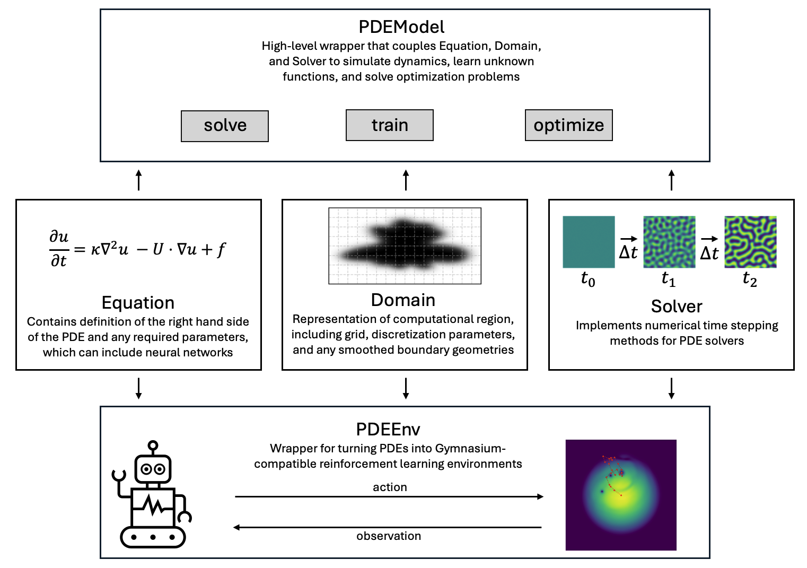
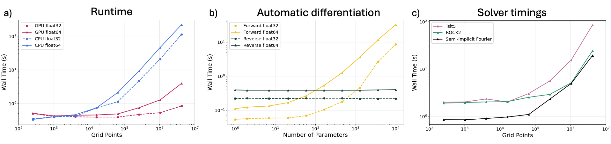
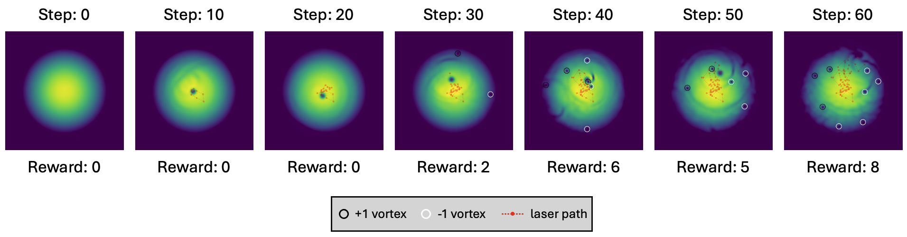

# Summary
Pattern formation occurs in diverse physical systems across many length scales, from quantum systems to planetary atmospheres, and has applications in nanotechnology and biology [@barad2021; @kim20224].
The physical laws and dynamics that dictate pattern formation are often expressed in the form of partial differential equations (PDEs).
To learn models for these systems, optimize, control, or apply modern machine learning techniques to these systems, we need fast, differentiable, and GPU-powered numerical solvers.

The `pat-pde-opt` package provides implementations of PDEs that describe pattern formation in a range of physical systems.
The package also provides a framework for extending the implementation to more PDEs.
The code is written in JAX [@jax2018] and is fully differentiable and GPU-accelerated.
To solve the time-dependent PDEs, `pat-pde-opt` converts the PDEs using the method of lines into a system of ordinary differential equations (ODEs), and evolves the resulting ODEs using `diffrax` [@kidger2021]. 
Notably, `diffrax` provides binomial checkpointed adjoint methods, which is often essential for differentiating through PDE solves with a large number of time steps, as the memory requirements of backpropagation scales linearly with the number of steps.
`pat-pde-opt` also provides implementations of specialized time stepping methods for many pattern forming systems, including semi-implicit Fourier methods [@zhu1999], Strang splitting [@bao2012], and the stabilized explicit Runge-Kutta method ROCK2 [@abdulle2001].
For simple support for non-regular geometries, some PDEs are implemented using the smoothed boundary method for complex geometries [@yu2012].
The goal of this package is to provide specialized code for the integration of physical simulations of pattern formation with inverse design, optimization, machine learning, and control. 

The `pat-pde-opt` package is organized around Domains, Equations, and Solvers \autoref{fig:overview}.
{ width=50% }
The Domain class sets up the computational region for the simulation, including the mesh and axes in both real and Fourier space.
The Domain also stores the Shape, which is used in the context of the smoothed boundary method.
The Shape is initialized with a binary mask where 1s indicate the geometry and 0s indicate the empty space.
Upon initialization, the binary mask is converted to a mask with a smoothly varying shape parameter at the boundary, as required for the smoothed boundary method.
This smoothing is accomplished by evolving an Allen-Cahn equation with a laplacian term with reduced curvature minimization to maintain sharply curved features of the original shape.
The degree of smoothing and curvature minimization can be controlled with hyperparameters.
The Equation class consists of implementations of the right hand side of the various PDEs with both finite difference and Fourier spectral methods. 
Each class of PDE is contained in a module, and within each module there exists different implementations of the PDE for different sets of parameters, dimensionality, and other variations.
Parameters for the PDEs can in general be `Equinox` modules [@kidger2021equinox], making it easy to take gradients with respect to the parameters regardless of the type of function using filter or partition transformations.
Several useful functions that can be used as PDE parameters are provided as `Equinox` modules in the functions module, including periodic CNNs and Legendre polynomial expansions.
The solvers are subclasses of `diffrax.AbstractSolver` and provide implementations of specialized time stepping methods for specific PDEs.
The specification of a Domain, Equation, and a Solver is required for all downstream use cases of `pat-pde-opt`.

Two interfaces are provided through the `PDEModel` and `PDEEnv` class for integrating with machine learning methods.
The `PDEModel` is initialized with a combination of a Domain, Equation, and Solver, and provides three main methods.
The first is a `solve` method for solving the specified Equation on the given Domain with the specified Solver.
In addition, the `train` method provides the utilities for fitting parameters or functions within the Equation to a dataset.
The `train` method uses a multiple shooting approach which is both computationally faster and more robust to noise in the dataset than other approaches.
The multiple shooting approach works by `vmap`-ing over multiple starting points in the dataset and evaluating the loss at future time points relative to each starting point. 
The specific starting points and residual evaluation points are specified through the `inds` argument of the `train` function.
Currently, the optimization can be performed using the Levenberg-Marquardt method or BFGS, whose implementations are provided through the `optimistix` package [@optimistix2024].
Gradients can be computed using forward or reverse mode automatic differentiation, which scale differently with the number of parameters \autoref{fig:benchmark} [ma2021].
The Levenberg-Marquardt method requires Jacobians of the residuals for the Hessian approximation, which can be computed using forward mode automatic differentiation.
Since the Levenberg-Marquardt method uses Gauss-Newton approximations of the Hessian, this method generally converges faster than BFGS. 
However, BFGS does not require the Jacobian of the residuals for the Hessian approximation and thus the gradients can be computed easily using backpropagation, which scales much better with the number of parameters \autoref{fig:benchmark}.
This tradeoff between scaling with parameter numbers and convergence of optimization must be considered for these differentiable physics optimization problems.
Finally, the `optimize` method use BFGS minimize a scalar function of the solution, which is specified in the `objective_function` argument.

For reference, we benchmark the performance of numerically solving and computing gradients of PDE solutions \autoref{fig:benchmark}.
We report the wall time scaling as a function of grid points of 10,000 time steps of the Cahn-Hilliard equation using a semi-implicit Fourier time stepping method, run on both GPU and CPU with Float32 and Float64 precision.
We further show the wall time scaling with respect to the number of parameters when computing gradients through 1,000 time steps of the Cahn-Hilliard equation using forward- and reverse-mode automatic differentiation.
Finally, we compare a Tsit5 time stepper with our ROCK2 implementation and semi-implicit Fourier method, all coupled with a PID step size controller for the Cahn-Hilliard equation.
`PDEModel` streamlines model learning and optimization by unifying a Domain, Equation, and Solver.

The `PDEEnv` class is useful for turning a PDE into a `Gymnasium`-registered reinforcement learning (RL) environment that can be used to train RL agents with libraries like Stable Baselines [@towers2024; raffin2021].
In addition to the Domain, Equation, and Solver, the `PDEEnv` class requires a `step_dt`, which is the time span of one step of the environment, and a `numeric_dt` which is the time step to use for numerical integration. 
These are separate parameters because the reaction time of the agent is often larger than the time step needed for numerical stability.
Beyond these fields, many other pieces of informataion must be provided to form the RL environment, including reward functions, observation functions, and reset functions.

We demonstrate an example of creating an RL environment designed to form vortices in a Bose-Einstein condensate by controlling the position of an external laser source \autoref{fig:rl_env}.
The episode is simulated by sampling random actions that move the position of the laser (red line), where the reward is calculated by counting the number of vortices in the condensate (black and white circles).

# Statement of need
Pattern formation and phase separation are fundamental processes across physics, chemistry, biology, and materials science, with technological applications ranging from developmental biology to nanostructured materials. 
At the same time, the rapid growth of scientific machine learning has shown how partial differential equation (PDE) models can be combined with modern optimization and learning techniques to accelerate discovery, most prominently in applications such as weather and climate modeling [@kochkov2024] and material modeling [@zhao2020; @zhao2023]. 
Building on these advances, there is growing interest in extending such capabilities to pattern-forming systems, where fast, differentiable, and GPU-accelerated PDE solvers can enable parameter learning, design optimization, and reinforcement learning–based control.
To support this, the community needs open-source tools that are performant, easy to use, well documented, and straightforward to extend.
Existing simulation libraries for pattern formation provide valuable tools, but they are often not directly integrated with these machine learning workflows [@walker2023; @burns2020; @zwicker2020; @daubner2025].
In addition, packages that treat PDEs as reinforcement learning environments are generally restricted to a small set of select equations [@bhan2024; @werner2024].
Our framework extends this ecosystem by coupling performant PDE solvers with differentiability, RL interfaces, and optimization capabilities, making it easier to study and control complex spatiotemporal dynamics across disciplines.
The code is currently being used by researchers to learn models for battery nanoparticles, optimize phase separation in materials, and control pattern formation in Bose-Einstein condensates.
In the future, we plan to broaden the range of physical systems supported by the package and further advance numerical methods for differentiable simulation, with the goal of making machine learning for PDEs framework that is accessible, practical, and easy to use.

# Acknowledgements
The authors acknowledge the MIT Office of Research Computing and Data for providing computational resources and advice on open-source scientific computing software.

# References
